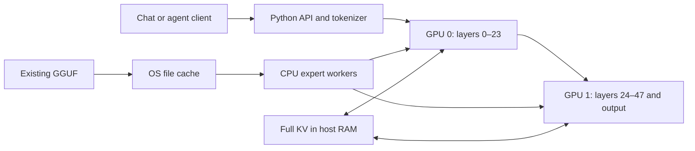

# Strata on your dual RTX 4090 system

Written on 2026-10-02 for Ubuntu 22.04, two 24 GB RTX 4090s, a Ryzen 9950X and 96 GB RAM
(about 66 GB normally available). The setup changes are committed on `develop` as `a380441`.
The server was stopped at your request. The commands below are instructions for future use;
the 1M-context and vision experiments have not been started or tested on your installation.

Your tested configuration is [strata-unsloth-ud-q4_k_xl.json](../strata-unsloth-ud-q4_k_xl.json):
native context **262144**, **FP16 KV**, both GPUs, direct mapping of your existing Unsloth GGUF,
and MTP speculative decoding. Context **200000** was also tested successfully. Measured
requests, hardware, compiler and calibration details are in the
[benchmark report](../bench/results/2026-10-02-dual-4090-q4-fp16/README.md).

For day-to-day use, go to [the exact launch commands](#8-exact-commands-for-everyday-use).
The additional installation options are [without `.venv`](#9-build-and-run-without-venv),
[Docker](#10-build-and-run-with-docker), and [one GPU with 64 GB RAM](#11-another-machine-one-gpu-and-64-gb-ram).

## 1. How Strata works

Strata is an inference engine specialized for this model family. It combines CUDA GPU work,
CPU expert computation, system RAM and storage instead of requiring the whole model in VRAM.
The Python server handles tokenization, chat templates, APIs, request scheduling and the web app.
The C++ engine computes the model. Python is not multiplying the model's weight matrices.

Your model has 48 layers, each with 512 routed experts: 24576 expert instances altogether.
A router selects 10 experts **per layer per token**, and there is also a shared expert.
Keeping every expert available does not require executing every expert for every token.
Strata does not prune your Q4 model to make it fit.

On your system, the work is placed as follows:

| Component | Placement and purpose |
| --- | --- |
| GPU 0 | Layers 0–23, their attention/recurrent state, dense work and cached experts |
| GPU 1 | Layers 24–47, their state and cached experts, output head and MTP draft layer |
| CPU | Computes selected experts missing from the owning GPU's expert cache |
| System RAM | Full streamed KV, checkpoints, runtime state and reclaimable OS cache of mapped expert pages |
| Existing GGUF on NVMe | All original expert tensors and the PLE lookup table; no extra `experts.bin` copy |



This is a layer split: one decode window passes through the first stage and then the second.
Two cards increase the available expert-cache capacity; they do not automatically double
single-conversation speed. The CPU and GPU can compute different selected experts concurrently.
The cards communicate over PCIe; this configuration does not require NVLink.

The GPU expert cache initially holds experts ranked by the shipped routing profile. Your final
startup reported 10900 cached expert slots across both cards, about 31.8 GiB of expert weights.
An expert outside that cache is read through the mapped GGUF and computed on the CPU.
Linux can reclaim its cached file pages for other applications. Mapping the 103.69 GiB GGUF
does not allocate a 103.69 GiB private RAM copy.

The model also has a large PLE n-gram embedding table. Strata fetches the required rows rather
than loading the entire table onto a GPU. The default PLE path uses direct disk I/O with a
bounded row cache; this is separate from the OS file cache serving mapped expert weights.

Attention is hybrid. There are 36 recurrent GDN layers and 12 QSA attention layers. The latter
use the model's learned sparse selection over the available history. The recurrent layers
maintain state instead of a growing, full attention KV history of their own. These are model
architecture properties, not context truncation introduced for this PC.

**Prefill** reads your input in chunks, up to 8192 tokens with the current `--prefill auto` path.
Each GPU temporarily lends expert-cache space to prompt buffers and restores those experts
afterward. **Decode** generates the answer. MTP proposes several future tokens, and the main
Q4 model verifies them in a window. The Q2 MTP weights affect proposal quality and acceptance;
an unverified proposal is not simply accepted as the final answer.

Three different meanings of “cache” matter:

- **Expert cache:** model weights in VRAM. Increasing it can reduce CPU expert work.
- **KV cache:** conversation attention state. Its precision and capacity are controlled separately.
- **Prompt checkpoints/conversation parking:** saved state used to resume matching histories.

Your `--kv-resident 32768` keeps a bounded set of KV cells in VRAM while the complete configured
KV capacity lives in pinned RAM. It does **not** reduce the context to 32768 tokens, or discard
everything older than that. Selected historical cells can be fetched back into VRAM.

Source: [engine details](DETAILS.md#how-it-works), [multi-GPU placement](MULTI_GPU.md),
[QSA implementation](../include/strata/kernels/qsa.hpp).

## 2. How this differs from llama.cpp

Strata is not just a launcher for `llama-server`. It reuses pieces of llama.cpp/ggml, but has its
own inference loop, scheduling, expert cache, state management and Python server. Its optional
vision helper uses llama.cpp's mtmd library.

| Area | Strata in this checkout | llama.cpp |
| --- | --- | --- |
| Scope | Specialized for this model geometry and supported packs | General engine supporting many architectures |
| Loading | Prepares a small pack/index; experts can remain in the original GGUF | Loads supported GGUF models directly |
| CPU/GPU placement | Per-expert GPU cache plus CPU work for misses | CPU/GPU offloading, including controls for MoE weights |
| Multiple GPUs | Contiguous layer stages with expert caches | Layer, row and experimental tensor splitting |
| Drafting | Model-specific MTP and prompt lookup integrated into the engine | Several speculative decoding mechanisms |
| Concurrent requests | One generation at a time in the Python server | Parallel slots and continuous batching |
| KV options | `fp16`, `int8`, `q4_0`, `k8v4` | Separate key/value type choices, including BF16 |

The upstream features in the last column are documented by
[llama.cpp](https://github.com/ggml-org/llama.cpp/blob/master/README.md) and its
[server documentation](https://github.com/ggml-org/llama.cpp/blob/master/tools/server/README.md).
This is a capability comparison, not a throughput comparison on your hardware. We did not
benchmark llama.cpp against this installation.

The algorithms target the same model, but numerical implementations differ. In particular,
Strata must convert 195 small Q8_0 projections in this Unsloth file to BF16; the PLE convolution
is loaded as FP16. The main routed expert tensors retain their GGUF quantization. CPU and GPU
expert kernels can round differently as well. Thus retaining Q4_K_XL and FP16 KV does not imply
identical logits or byte-identical answers to llama.cpp. Details:
[Unsloth conversion and quality checks](UNSLOTH_Q4.md#the-numbers-what-is-native-and-what-is-converted).

## 3. What changed for your setup

Most inference features already existed. The work made setup use them correctly for your files
and hardware, and supplied a local MTP import path.

| Change | Why it was needed |
| --- | --- |
| Recognize the exact merged Unsloth filename | Your model is one merged file, alongside other GGUFs and MTP files, rather than the four published shards |
| Allow explicit Unsloth `--low-ram mmap` with two GPUs | The installer's usual resident-RAM-budget path forced this model onto one GPU |
| Avoid an `experts.bin` copy | The native engine can already map the GGUF's expert tensors; another roughly 77 GB file was unnecessary |
| Expose `--kv fp16` at every context and fix memory estimates | Long-context setup previously offered compressed KV; estimates now account for the chosen format |
| Add `--mtp-gguf` and [the importer](../tools/mtp_import.py) | Reuse your BF16 MTP instead of downloading it; all 31 reconstructed tensors must match the pinned checkpoint hashes |
| Preserve local model, KV, streaming, GPU and reserve settings | Adopting/updating an installation should not silently lose these choices |
| Expose `--vram-reserve-mib` and distinguish calibration configurations | Cache sizing and performance measurements depend on precision and memory placement |
| Improve GEMM failure diagnostics and startup messages | Report shape/device/free VRAM on failure, and describe mapped loading accurately |
| Add regression tests and benchmark artifacts | Check setup/import behavior and record what actually ran on your machine |

The local installation includes a Release CUDA build for SM 89, a small compatible pack and the
verified MTP runtime. The 1280 MiB VRAM reserve was important: the default 700 MiB reserve failed
in prompt processing or decode graph creation. We validated both 200000 and 262144 after raising it.
Calibration retained the default 15 CPU workers and selected a draft confidence floor of 0.70.

The existing engine supplied layer splitting, native Q4 expert kernels, KV streaming, MTP,
YaRN and the general vision path. We did **not** implement BF16 KV, simultaneous agent decoding
or a unified multi-sequence KV allocator. The only changed C++ engine file added failure diagnostics;
it did not change matrix multiplication arithmetic.

The prior validation passed 167 setup tests, 9 MTP importer tests, 14 calibration tests, 100 server
tests and 10 CUDA tests. Real requests recovered three markers distributed across near-full
200K and 262K inputs. Those recall tests are not a comprehensive accuracy evaluation.

## 4. Future builds and dependencies

Nothing else needs installing for the current text-only build. Your installation already has:

| Dependency | What it supplies |
| --- | --- |
| Working NVIDIA driver | GPU access; measured driver was 610.57.04 |
| CUDA Toolkit under `/usr/local/cuda-13.0` | `nvcc`, CUDA headers, runtime and cuBLAS development libraries |
| GCC/G++ 11; GCC/G++ 12 also installed | Host C++ compiler; Strata requires C++20 |
| Python 3.10+ and `.venv` | Server, tokenizer, setup and packing tools |
| Packages in [requirements.txt](../requirements.txt) | NumPy, Jinja2, regex, Pillow, requests, psutil, CMake, Ninja and their dependencies |
| Pinned `third_party/llama.cpp` | ggml kernels, gguf-py and mtmd sources; revision `3cf03257f219afbe7334045ff7c6a06ac68c627d` |

The `.venv` also has `nvidia-cublas==13.0.2.14` and `nvidia-cuda-runtime==13.0.96` from setup.
These wheels supply runtime libraries, **not the CUDA compiler**. No PyTorch installation is needed.
The current config loads the installed toolkit's libraries through `lib_dirs`.

On a fresh Ubuntu machine, the general host packages are `python3`, `python3-venv`, `python3-pip`,
`build-essential` and `git`, plus an appropriate NVIDIA driver and CUDA Toolkit. CMake must be
at least 3.24; use `.venv/bin/cmake` rather than relying on Ubuntu 22.04's system CMake.
Setup installs its pinned Python requirements and fetches the pinned llama.cpp source.
If preparing Python manually on a fresh checkout, the normal steps are:

```sh
python3 -m venv .venv
.venv/bin/python -m pip install -r requirements.txt
```

Do not recreate the existing environment for an ordinary rebuild. Your default `g++` was too old;
select `/usr/bin/g++-11` or `/usr/bin/g++-12` explicitly. The measured build used **GCC 11**.

### Routine rebuild using setup

From `/home/goodi/Programs/Strata`, with the server stopped:

```sh
CC=/usr/bin/gcc-11 CXX=/usr/bin/g++-11 CUDAHOSTCXX=/usr/bin/g++-11 \
./setup.sh --setup --yes --family unsloth --model UD-Q4_K_XL \
  --gguf-dir "$HOME/LLMs" \
  --mtp-gguf "$HOME/LLMs/mtp-Qwen3.8-Flash-Next-BF16.gguf" \
  --data-dir "$PWD/strata-data" --low-ram mmap --gpus 0,1 \
  --context 262144 --kv fp16 --kv-streaming on \
  --vram-reserve-mib 1280 --vision no --build --no-start
```

`--build` chooses compilation instead of a release binary. Setup rebuilds when its engine source
fingerprint changes; if it already matches, it skips compilation. It copies the resulting binary
to `engine/` and updates `engine/BUILD.json`. `--no-start` leaves the server stopped.

This command also regenerates the runtime config. Inspect its tuning afterward: your final
settings are `--pcie-frac 0` and `--spec-min-p 0.70`; regeneration can restore defaults or apply
a stored calibration. Direct JSON edits are simpler for changing runtime settings alone.

### Manual incremental build

For a C++ edit with the existing GCC 11 build cache:

```sh
.venv/bin/cmake --build build --target strata strata-device -j 8
```

This produces `build/strata`; the normal server config launches `engine/strata`. To install that
manual build and refresh setup's fingerprint:

```sh
cp build/strata engine/strata
cp build/strata-device engine/strata-device
.venv/bin/python - <<'PY'
import json
from pathlib import Path
import setup

p = Path("engine/BUILD.json")
meta = json.loads(p.read_text())
meta.update(source="local", version=setup.source_version(),
            src=setup.source_hash(setup.ENGINE_SOURCES), archs=[89],
            host_compiler="/usr/bin/g++-11", mmq_kquants=False)
p.write_text(json.dumps(meta, indent=2) + "\n")
PY
```

### Clean configuration, or choosing GCC 12

The configuration used for the measured build was:

```sh
.venv/bin/cmake -S . -B build -G Ninja \
  -DCMAKE_BUILD_TYPE=Release \
  -DCMAKE_C_COMPILER=/usr/bin/gcc-11 \
  -DCMAKE_CXX_COMPILER=/usr/bin/g++-11 \
  -DSTRATA_ENABLE_CUDA=ON \
  -DCMAKE_CUDA_COMPILER=/usr/local/cuda-13.0/bin/nvcc \
  -DCMAKE_CUDA_HOST_COMPILER=/usr/bin/g++-11 \
  -DCMAKE_CUDA_ARCHITECTURES=89 \
  -DSTRATA_GGML_DIR="$PWD/third_party/llama.cpp" \
  -DSTRATA_MMQ_KQUANTS=OFF \
  -DSTRATA_BUILD_TESTS=ON
```

For a separate fresh GCC 12 build, use `-B build/gcc12` and change all three compiler paths from
11 to 12. Build and copy from that directory, and record G++ 12 in the metadata snippet above.
The separate directory leaves the measured GCC 11 cache intact. Later manual GCC 12 rebuilds
must continue using `build/gcc12`; setup's normal build directory remains `build`.

CMake remembers compiler paths on its first configuration. Changing `CC`/`CXX` alone does not
switch an existing build cache. SM **89** is the RTX 4090 target. Keep the optional K-quant MMQ
kernels off for the measured arithmetic path; enabling them adds INT8 activation rounding and
would need separate performance and quality checks.

Python/server/doc changes do not require recompiling the C++ engine. Restart the Python server
after server code or runtime-config edits. A changed model/packing contract can require repacking;
an ordinary kernel edit does not require downloading the model again.

To run the relevant GPU checks after a kernel change:

```sh
.venv/bin/cmake --build build \
  --target kv_stream_parity native_expert_parity qsa_parity conv_cache_test -j 8
.venv/bin/ctest --test-dir build \
  -R '^(kv_stream_parity|native_expert_parity.*|qsa_parity|conv_cache_test)$' \
  --output-on-failure
```

## 5. Changing parameters and agent count

Edit [the runtime JSON](../strata-unsloth-ud-q4_k_xl.json) while the server is stopped. Engine
options are flag/value pairs in `args`; GPU selection and layer splitting are top-level fields.
No rebuild is needed for these settings.

| Setting | Current value | Meaning |
| --- | --- | --- |
| `args`: `--max-context` | `262144` | Total prompt and answer capacity; `200000` is your tested fallback |
| `args`: `--kv` | `fp16` | KV storage format, independent of the model's Q4 weights |
| `args`: `--kv-resident` | `32768` | Resident GPU KV capacity while full KV streams from RAM |
| `args`: `--expert-cache` | `auto` | Size expert caches around available VRAM and other allocations |
| `args`: `--vram-reserve-mib` | `1280` | Headroom outside the expert cache for runtime work |
| `args`: `--prefill` | `auto` | Prompt chunk sizing |
| `args`: `--spec` | `4` | MTP draft window setting |
| `args`: `--spec-min-p` | `0.70` | Confidence threshold for extending a draft |
| `args`: `--pcie-frac` | `0` | Mapped, unpinned expert misses stay on the CPU in this setup |
| `args`: `--pool-workers` | Omitted; 15 selected | CPU expert worker count; fewer workers did not win calibration |
| Top-level `gpu` | `[0, 1]` | Physical GPU IDs exposed to the engine |
| Top-level `layer_split` | `"auto"` | Split search; it selected 24 layers on each card |

The supported cache formats are:

| `--kv` value | Storage | Consequence |
| --- | --- | --- |
| `fp16` | Half precision K and V | Your tested choice; no optional INT8/Q4 KV compression |
| `int8` | Signed 8-bit K/V with FP16 scales | Lower memory, additional rounding; supports streaming |
| `q4_0` | Rotated 4-bit K/V | Still smaller; larger potential quality tradeoff; supports streaming |
| `k8v4` | INT8 keys and rotated 4-bit values | Cannot be combined with positive `--kv-resident` |

Use Strata's `int8` spelling, not `q8_0`. Other model-weight packs supported by setup include the
specific Q2_0, IQ2_XS, IQ3_XXS, IQ3_S and Coder IQ1_M files. Those change weight quantization or
model variant; they are not interchangeable cache settings or arbitrary supported GGUFs.

Generation controls such as `temperature`, `top_p`, `max_tokens` and `reasoning_effort` normally
belong in each API request. `max_tokens` limits the answer; it does not resize the engine's context.

**There is no number-of-agents flag in Strata.** You can connect several agent clients to the same
OpenAI-compatible API. Their inference requests queue, and one generates at a time. Separate
clients can do their own non-inference work concurrently, but that does not create concurrent
model decoding.

`--conversation-cache-slots` controls parked histories, not simultaneous inference slots.
On a one-GPU configuration, for example, the optional flags
`--conversation-cache-mib 8192 --conversation-cache-slots 4` permit up to four parked histories
within the RAM budget. Large histories may fill that budget before four fit. The current
**two-GPU layer split rejects this parking feature**, so do not add those flags to your current
config. Ordinary matching-prefix checkpoints still work, with possible reprocessing when
switching unrelated histories. More clients do not guarantee that every history remains cached.

llama.cpp's `-np 2 -kvu` controls inference slots and a shared KV pool. Strata has no equivalent.
Implementing it would require multiple independent recurrent/attention states and a scheduler
able to batch their work safely, rather than increasing a counter. Source:
[service serialization](../serve/server.py), [engine parking guard](../src/program/generate.cpp).

When you want to start the tested config again:

```sh
.venv/bin/python -m serve.server --engine strata \
  --config strata-unsloth-ud-q4_k_xl.json --host 127.0.0.1 --port 8080
```

The web UI is `http://127.0.0.1:8080`; the API base URL is `http://127.0.0.1:8080/v1`.
`./run-unsloth-ud-q4_k_xl.sh` starts the same config and also opens the browser.
Ctrl+C in the server terminal stops it and its engine. Keep localhost binding; remote access
needs `--api-key` as described in [AI_SETUP.md](AI_SETUP.md).

## 6. Extending context to 1M with YaRN; BF16 KV

**A 1M context is an experiment, not an accuracy-preserving upgrade of the tested configuration.**
YaRN changes the rotary position encoding used by attention. Its frequency interpolation and
magnitude correction extend the position range, but also change arithmetic within the original
range. The original method is described in the
[YaRN paper](https://arxiv.org/abs/2309.00071). KV compression independently introduces rounding.
Neither guarantees unchanged model accuracy at 1M.

Strata already implements `--rope-scaling yarn`. Its repository reports contributor experiments
past the trained window, including 512K recall probes and a 1M run, on other models/hardware.
They do not validate 1M Unsloth Q4_K_XL on your machine. See
[RoPE settings](DETAILS.md) and the [512K experiments](../bench/results/2026-09-28-rope-scaling/README.md).

The clean four-times extension is:

```text
--max-context 1048576
--kv int8
--kv-resident 32768
--rope-scaling yarn
--rope-scale 4
--yarn-orig-ctx 262144
```

Here “1M” means **1048576** positions, four times the native window. For exactly **1000000**,
use `--max-context 1000000` and `--rope-scale 3.814697265625`. Leave the original context at
262144. Do not change only the capacity and omit the positional scaling.

K/V-only storage estimates, including the 12 main attention layers and the MTP layer:

| Cache | At 262144 | At 1048576 | Placement with this recipe |
| --- | ---: | ---: | --- |
| FP16 | 6.50 GiB | 26.00 GiB | Host RAM, plus resident GPU copies |
| INT8 | 3.35 GiB | 13.41 GiB | Host RAM, plus resident GPU copies |
| Q4_0 | 1.83 GiB | 7.31 GiB | Host RAM, plus resident GPU copies |
| K8V4 | 2.65 GiB | 10.59 GiB | VRAM; streaming unavailable |

These figures exclude alignment, indexer state, checkpoints and all workspaces. Capacity is
reserved at startup, even if the first request is short. At 1M, additional allocations include
about 1.5 GiB of pooled main-model indexer keys across the GPUs, 256 MiB of RoPE tables per
GPU, roughly 396 MiB of main INT8 resident K/V plus a draft ring, and recurrent/checkpoint state.
The model weights, graphs and prompt buffers remain. More pinned KV leaves less reclaimable RAM
for model pages, so decoding can become slower even when allocation succeeds.

INT8 with streaming is a plausible first 1M experiment on this PC. FP16 1M is not categorically
forbidden, but its 26 GiB K/V allocation has a much larger RAM cost. No 1M memory fit, throughput
or quality result has been measured here. Keep automatic expert-cache sizing and the VRAM reserve.

Create a separate experimental config so the tested native FP16 configuration remains available:

```sh
.venv/bin/python - <<'PY'
import json
from pathlib import Path

source = Path("strata-unsloth-ud-q4_k_xl.json")
destination = Path("strata-unsloth-ud-q4_k_xl-1m-int8.json")
config = json.loads(source.read_text())
args = config["args"]

def set_arg(flag, value):
    if flag in args:
        args[args.index(flag) + 1] = str(value)
    else:
        args.extend([flag, str(value)])

set_arg("--max-context", 1048576)
set_arg("--kv", "int8")
set_arg("--kv-resident", 32768)
set_arg("--rope-scaling", "yarn")
set_arg("--rope-scale", 4)
set_arg("--yarn-orig-ctx", 262144)
config["log"] = str(destination.with_suffix(".log").resolve())
destination.write_text(json.dumps(config, indent=2) + "\n")
print(destination)
PY
```

When you choose to run that experiment:

```sh
.venv/bin/python -m serve.server --engine strata \
  --config strata-unsloth-ud-q4_k_xl-1m-int8.json --host 127.0.0.1 --port 8080
```

Check `/health` and `/metrics` for context, KV format, reserve/headroom and successful loading.
Then test progressively larger inputs with the token-counted benchmark, for example 32700,
262000, 524000 and 1048300 prompt tokens. One command is:

```sh
.venv/bin/python bench/results/2026-10-02-dual-4090-q4-fp16/benchmark.py \
  --config strata-unsloth-ud-q4_k_xl-1m-int8.json \
  --tokens 1048300 --out strata-data/validation/experimental-1m.json
```

The window includes the answer: requests need `prompt + max_tokens + 8 <= max_context`.
Passing marker recall is only a first check; also test your actual long-document and coding tasks.
Return to the original JSON to restore native FP16 behavior. RoPE changes require restarting;
existing cached keys were already rotated under the old settings.

**BF16 KV is not implemented.** `--kv bf16` is rejected; `--native-bf16` refers to model projection
execution, not the cache format. BF16 and FP16 both use 16 bits, so BF16 would not save memory
or enlarge the capacity. BF16 has greater exponent range and fewer fractional bits; it is not
universally more accurate. Adding it would require storage/kernel/state handling and validation.
The BF16 names of your MTP and projector describe their weights, not the conversation cache.

## 7. Vision using your local BF16 projector

**The installer currently disables vision for the Unsloth family.** `--vision gpu` in setup is
overridden to off for this model. Merely adding that flag or having an mmproj file nearby does
not enable images, and `engine/strata-vision` has not been built in your installation.

Your file is:

```text
/home/goodi/LLMs/mmproj-BF16-Qwen3.8-Flash-Next.gguf
```

Its inspected metadata reports a Qwen3-VL merger, BF16 weights, 27 vision layers and projection
width 2560, matching the text model's embedding width. The text model's image marker token IDs
also match Strata's image path. The pinned llama.cpp knows this text architecture. These checks
make a manual experiment reasonable; they do **not** establish end-to-end vision compatibility
or image quality. The earlier “no images” description meant no supported, tested installer path,
not proof that the projector cannot work.

The vision helper loads the text model vocabulary only, then encodes images with the projector.
It does not load a second 111 GB copy of the text model. Projected image rows and M-RoPE positions
are passed to Strata's text engine. The server starts and warms the helper before sizing the
engine's expert caches.

### Build the optional helper

Using your existing GCC 11/CUDA toolchain and pinned llama.cpp source:

```sh
.venv/bin/cmake -S tools/vision -B build-vision -G Ninja \
  -DCMAKE_BUILD_TYPE=Release \
  -DCMAKE_C_COMPILER=/usr/bin/gcc-11 \
  -DCMAKE_CXX_COMPILER=/usr/bin/g++-11 \
  -DLLAMA_DIR="$PWD/third_party/llama.cpp" \
  -DSTRATA_VISION_CUDA=ON \
  -DCMAKE_CUDA_COMPILER=/usr/local/cuda-13.0/bin/nvcc \
  -DCMAKE_CUDA_HOST_COMPILER=/usr/bin/g++-11 \
  -DCMAKE_CUDA_ARCHITECTURES=89

.venv/bin/cmake --build build-vision --target strata-vision -j 8
cp build-vision/bin/strata-vision engine/strata-vision
```

This builds mtmd/llama/ggml components as part of the helper. It does not need PyTorch or another
copy of the text weights. The existing Python requirements include Pillow for image handling.

### Create a separate vision config

Use the tested native-window configuration first, independently of the 1M experiment:

```sh
.venv/bin/python - <<'PY'
import json
from pathlib import Path

source = Path("strata-unsloth-ud-q4_k_xl.json")
destination = Path("strata-unsloth-ud-q4_k_xl-vision.json")
config = json.loads(source.read_text())
if "--vision" not in config["args"]:
    config["args"].append("--vision")
config["vision"] = {
    "exe": str(Path("engine/strata-vision").resolve()),
    "mmproj": "/home/goodi/LLMs/mmproj-BF16-Qwen3.8-Flash-Next.gguf",
    "model": "/home/goodi/LLMs/Qwen3.8-Flash-Next-UD-Q4_K_XL.gguf",
    "gpu": True,
    "cuda_device": 0,
    "max_tokens": 1024
}
config["log"] = str(destination.with_suffix(".log").resolve())
destination.write_text(json.dumps(config, indent=2) + "\n")
print(destination)
PY
```

Both additions matter: the top-level `vision` object starts the helper, and the engine's `--vision`
flag enables image input. Use your exact projector path; setup expects a differently ordered
filename and will not automatically find this file as its normal projector.

When you choose to test it:

```sh
.venv/bin/python -m serve.server --engine strata \
  --config strata-unsloth-ud-q4_k_xl-vision.json --host 127.0.0.1 --port 8080
```

Check that the helper starts and `/health` reports images enabled. Upload a screenshot containing
known text, test image recognition/OCR, then run a long text request to check the changed memory
budget. Encoder VRAM reduces the experts GPU 0 can hold; the approximately 1.4 GB quoted in the
general docs was measured on other configurations, not this projector on your dual 4090 setup.
Image tokens also consume context. `max_tokens` in the `vision` object controls image resolution
through the image-token budget; it is separate from the answer's API `max_tokens`.

For CPU image encoding, set `"gpu": false` and add `"threads": 16` in the vision object. A helper
built with CUDA can still run without GPU offload. CPU encoding avoids encoder VRAM allocation;
its latency on this machine has not been measured.

Keep these experimental settings in their own JSON. Rerunning ordinary Unsloth setup will still
configure text-only operation, and this guide has not changed that policy or enabled vision.
Sources: [vision helper](../tools/vision/strata_vision.cpp),
[server/helper integration](../serve/server.py), [Unsloth setup policy](../setup.py).

## 8. Exact commands for everyday use

Open a terminal and run this to start your existing, tested two-GPU configuration:

```sh
cd /home/goodi/Programs/Strata
.venv/bin/python -m serve.server --engine strata \
  --config strata-unsloth-ud-q4_k_xl.json --host 127.0.0.1 --port 8080
```

This command needs no environment activation, setup pass, compilation or model download.
It loads the prepared pack and MTP, uses both GPUs, and serves the native 262144-token FP16
configuration. Leave that terminal open. Wait for the `ready` message, then open
**http://127.0.0.1:8080** in your browser. To also open the browser automatically, use:

```sh
cd /home/goodi/Programs/Strata
./run-unsloth-ud-q4_k_xl.sh
```

From a second terminal, check readiness and send an example API request:

```sh
curl --fail http://127.0.0.1:8080/health
curl --fail http://127.0.0.1:8080/v1/models
curl --fail http://127.0.0.1:8080/v1/chat/completions \
  -H 'Content-Type: application/json' \
  --data '{"model":"qwen3.8-flash-next-unsloth-ud-q4_k_xl","messages":[{"role":"user","content":"Say hello in five words."}],"max_tokens":64,"reasoning_effort":"none"}'
```

In an OpenAI-compatible chat or agent app, enter base URL **http://127.0.0.1:8080/v1**, model
`qwen3.8-flash-next-unsloth-ud-q4_k_xl`, and an arbitrary placeholder API key if the client requires
one; the current localhost server has no authentication configured. The app's answer-token
limit is separate from the engine's context capacity. Press **Ctrl+C** in the server terminal
to stop both the server and engine.

If llama.cpp already uses port 8080, change the direct launch command to `--port 8081` and use
8081 in browser and client URLs. Both servers still share physical VRAM and RAM; a loaded
llama.cpp model reduces the memory Strata can use. Stop or unload that model before comparing
against the measurements in this guide.

## 9. Build and run without `.venv`

You can use Ubuntu's Python with dependencies in a private directory instead of a virtual
environment. The commands below keep Python packages under `.cache/python-no-venv/`, CMake
products under `build/no-venv-gcc11/`, and use the already installed CUDA Toolkit. They do not
install packages into system Python or your other applications.

**Use these commands directly.** `setup.sh` and the generated `run-*.sh` scripts use `.venv`.
Running the full installer as `python3 setup.py` is also unsuitable for this private-package
route: its pip step installs into the interpreter's normal environment and writes a stamp
under `sys.prefix`. Importing the specific source-download helper below does not run that installer.

### Dependencies and a separate build

On your current machine the host packages and Toolkit are already installed. On a fresh
Ubuntu 22.04 installation, the host packages for this recipe are:

```sh
sudo apt-get update
sudo apt-get install -y python3 python3-pip build-essential gcc-11 g++-11 git
```

Also install an NVIDIA driver compatible with CUDA 13 and the CUDA 13.0 Toolkit, following
[NVIDIA's Linux installation guide](https://docs.nvidia.com/cuda/archive/13.0.0/cuda-installation-guide-linux/index.html).
The commands below assume `nvcc` is at `/usr/local/cuda-13.0/bin/nvcc`. Use the same terminal
for the following dependency installation and build:

```sh
cd /home/goodi/Programs/Strata
STRATA_PY_DEPS="$PWD/.cache/python-no-venv/site-packages"
/usr/bin/python3 -m pip install --upgrade --target "$STRATA_PY_DEPS" -r requirements.txt
export PYTHONNOUSERSITE=1
export PYTHONPATH="$STRATA_PY_DEPS"
export PATH="$STRATA_PY_DEPS/bin:/usr/local/cuda-13.0/bin:/usr/bin:/bin"

/usr/bin/python3 -c 'import setup; print(setup.get_llama_cpp())'

cmake -S . -B build/no-venv-gcc11 -G Ninja \
  -DCMAKE_BUILD_TYPE=Release \
  -DCMAKE_MAKE_PROGRAM="$STRATA_PY_DEPS/bin/ninja" \
  -DCMAKE_C_COMPILER=/usr/bin/gcc-11 \
  -DCMAKE_CXX_COMPILER=/usr/bin/g++-11 \
  -DSTRATA_ENABLE_CUDA=ON \
  -DCMAKE_CUDA_COMPILER=/usr/local/cuda-13.0/bin/nvcc \
  -DCMAKE_CUDA_HOST_COMPILER=/usr/bin/g++-11 \
  -DCMAKE_CUDA_ARCHITECTURES=89 \
  -DSTRATA_GGML_DIR="$PWD/third_party/llama.cpp" \
  -DSTRATA_MMQ_KQUANTS=OFF \
  -DSTRATA_BUILD_TESTS=ON

cmake --build build/no-venv-gcc11 --target strata strata-device -j 8
mkdir -p engine
cp build/no-venv-gcc11/strata engine/strata
cp build/no-venv-gcc11/strata-device engine/strata-device

/usr/bin/python3 - <<'PY'
import json
from pathlib import Path
import setup

p = Path("engine/BUILD.json")
meta = json.loads(p.read_text()) if p.exists() else {}
meta.update(source="local", version=setup.source_version(),
            src=setup.source_hash(setup.ENGINE_SOURCES), archs=[89],
            host_compiler="/usr/bin/g++-11", mmq_kquants=False,
            vision="none", vision_src=None,
            cuda_dirs=["/usr/local/cuda-13.0/bin", "/usr/local/cuda-13.0/lib64"])
p.write_text(json.dumps(meta, indent=2) + "\n")
PY
```

The source helper reuses Strata's pinned `third_party/llama.cpp` when present, otherwise downloads
that revision into the Strata directory. It does not use or modify your separate llama.cpp
checkout. The main engine statically links its own ggml CPU libraries; no `cmake --install`
step or global ggml library replacement is needed. Runtime CUDA libraries come from the
Toolkit paths in your JSON, so this source-build route does not need NVIDIA Python wheels.

To use your installed GCC 12 instead, substitute `gcc-12`/`g++-12` in all three compiler options,
use `build/no-venv-gcc12` throughout, and record G++ 12 in the metadata. Parallel compiler
installation does not require changing the system's default compiler. These shell exports
apply to the current terminal; keep them out of global shell configuration.

### Run without `.venv`, including from a new terminal

Your existing pack, MTP and JSON work with this Python route unchanged. The exact launch is:

```sh
cd /home/goodi/Programs/Strata
env PYTHONNOUSERSITE=1 \
  PYTHONPATH="$PWD/.cache/python-no-venv/site-packages" \
  /usr/bin/python3 -m serve.server --engine strata \
  --config strata-unsloth-ud-q4_k_xl.json --host 127.0.0.1 --port 8080
```

Use the same browser/API URLs and Ctrl+C shutdown as section 8. Rebuilding later requires
restoring the build exports and running the same `cmake --build`, copy and metadata steps.
For the vision build in section 7, use this private `cmake` and `/usr/bin/python3` instead of
their `.venv/bin/` counterparts.

### Only for a fresh checkout with no prepared model data

Skip this subsection on your current machine: its pack and MTP already exist. After the
private-package exports and source download above, these commands prepare the same local
Q4 model without running the installer. Allow space for the small text pack plus the raw
MTP tensors and their runtime conversion; no full routed-expert copy is created.

```sh
export STRATA_GGUF_PY="$PWD/third_party/llama.cpp/gguf-py"
/usr/bin/python3 tools/iq_pack.py \
  --gguf "$HOME/LLMs/Qwen3.8-Flash-Next-UD-Q4_K_XL.gguf" \
  --out "$PWD/strata-data/packs/unsloth-ud-q4_k_xl" --compat-bf16
/usr/bin/python3 tools/mtp_import.py \
  --gguf "$HOME/LLMs/mtp-Qwen3.8-Flash-Next-BF16.gguf" \
  --out "$PWD/strata-data/mtp"
/usr/bin/python3 tools/mtp_pack.py --src "$PWD/strata-data/mtp" \
  --experts q2_0 --out "$PWD/strata-data/mtp/mtp-q2_0.gguf"
/usr/bin/python3 tools/mtp_rt.py --gguf "$PWD/strata-data/mtp/mtp-q2_0.gguf" \
  --out "$PWD/strata-data/mtp/rt"
cp data/draft_vocab.bin strata-data/mtp/rt/draft_vocab.bin
```

`iq_pack.py` also writes the tokenizer. The BF16 compatibility conversion and verified MTP
import have the same contracts as the normal setup. Do not add `--experts-bin` to this Q4 recipe.
Write a config with absolute paths for the destination machine:

```sh
/usr/bin/python3 - <<'PY'
import json
from pathlib import Path

root = Path.cwd().resolve()
model = Path.home() / "LLMs/Qwen3.8-Flash-Next-UD-Q4_K_XL.gguf"
pack = root / "strata-data/packs/unsloth-ud-q4_k_xl"
cfg = {
    "exe": str(root / "engine/strata"),
    "cwd": str(root),
    "tokenizer": str(pack / "tokenizer"),
    "model_name": "qwen3.8-flash-next-unsloth-ud-q4_k_xl",
    "log": str(root / "strata-unsloth-ud-q4_k_xl.log"),
    "lib_dirs": ["/usr/local/cuda-13.0/bin", "/usr/local/cuda-13.0/lib64"],
    "host": "127.0.0.1", "port": 8080,
    "gpu": [0, 1], "layer_split": "auto",
    "args": [
        "--pack", str(pack), "--native", str(model), "--ple-gguf", str(model),
        "--expert-profile", str(root / "data/expert-profile.bin"),
        "--expert-cache", "auto", "--prefill", "auto", "--spec", "4",
        "--mtp", str(root / "strata-data/mtp/rt"),
        "--max-context", "262144", "--kv", "fp16", "--mmap-experts",
        "--kv-resident", "32768", "--stats", "--vram-reserve-mib", "1280",
        "--spec-min-p", "0.70", "--pcie-frac", "0"
    ]
}
Path("strata-unsloth-ud-q4_k_xl.json").write_text(json.dumps(cfg, indent=2) + "\n")
PY
```

This manual config targets your two 4090s. For one GPU, use `"gpu": 0`, omit `layer_split`,
and begin with `--max-context 200000` as discussed in section 11. A different GPU also needs
its own CUDA architecture in the build; the normal setup detects that automatically.

## 10. Build and run with Docker

Docker provides a separate Linux user environment, compiler, CUDA Toolkit, Python packages
and pinned llama.cpp source. It does not change your existing llama.cpp installation or
require `.venv` on the host. The repository's image uses a `.venv` **inside the container**.
The normal host `.venv` route is already separate from llama.cpp; Docker is useful when you
also want the compiler and Toolkit dependencies contained.

**This Docker recipe has been checked against the code and documentation, but has not been
built or benchmarked on your machine.** It retains Q4 weights, FP16 KV, streaming and your
tuning flags. The stock image uses CUDA 13.0 on Ubuntu 24.04 and that image's default host
compiler, rather than your measured Ubuntu 22.04/GCC 11 build. Optional K-quant MMQ kernels
remain off. Do not transfer the host throughput measurements to it without testing.

### Host prerequisites

The host needs a compatible NVIDIA driver, Docker Engine and NVIDIA Container Toolkit.
It does not need a host CUDA Toolkit for this container build. Your measured driver 610.57.04
supports CUDA 13; NVIDIA's CUDA 13 compatibility floor is driver branch 580. See
[CUDA compatibility](https://docs.nvidia.com/deploy/cuda-compatibility/minor-version-compatibility.html).
For a fresh host, follow the official
[Docker installation](https://docs.docker.com/engine/install/ubuntu/) and
[NVIDIA Container Toolkit installation](https://docs.nvidia.com/datacenter/cloud-native/container-toolkit/latest/install-guide.html).
After installing the toolkit, its Docker configuration commands are:

```sh
sudo nvidia-ctk runtime configure --runtime=docker
sudo systemctl restart docker
```

This one-time Docker restart can affect other running containers. The commands below assume
your user can run `docker`; use your installation's configured Docker permissions.

### Build an RTX 4090 image from committed source

Use a clean build context so your model data and host Python packages are not sent to Docker:

```sh
cd /home/goodi/Programs/Strata
STRATA_DOCKER_CONTEXT="$(mktemp -d /tmp/strata-docker.XXXXXX)"
git archive HEAD | tar -x -C "$STRATA_DOCKER_CONTEXT"
docker build --build-arg CUDA_ARCHITECTURES=89 --build-arg BUILD_VISION=0 \
  -t strata-dual4090:develop "$STRATA_DOCKER_CONTEXT"
```

This uses [the repository Dockerfile](../Dockerfile), compiles for SM 89, and skips the untested
vision helper. `git archive HEAD` includes committed files only; commit future engine changes
before using this recipe. It includes your `a380441` compatibility changes. Source changes
require a new archive and image build; model weights are mounted separately at runtime.

### Prepare a separate container config

The stock [entrypoint](../docker-entrypoint.sh) cannot forward all your local GGUF/MTP and
streaming/reserve choices. This recipe launches the server directly with a copy of your
working config. It remaps paths and adds an API key for the container's required `0.0.0.0`
listener. The host's original JSON remains unchanged.

```sh
cd /home/goodi/Programs/Strata
mkdir -p .cache/docker/config .cache/docker/logs
/usr/bin/python3 - <<'PY'
import json
import secrets
from pathlib import Path

root = Path.cwd().resolve()
cfg = json.loads((root / "strata-unsloth-ud-q4_k_xl.json").read_text())
prefixes = (
    (root / "strata-data", Path("/data")),
    (Path.home() / "LLMs", Path("/models")),
    (root, Path("/opt/strata")),
)

def remap(value):
    if isinstance(value, dict):
        return {key: remap(item) for key, item in value.items()}
    if isinstance(value, list):
        return [remap(item) for item in value]
    if isinstance(value, str) and value.startswith("/"):
        for old, new in prefixes:
            try:
                return str(new / Path(value).relative_to(old))
            except ValueError:
                pass
    return value

cfg = remap(cfg)
cfg.update(host="0.0.0.0", port=8080, log="/logs/strata-docker.log",
           lib_dirs=["/usr/local/cuda/lib64"], api_key=secrets.token_urlsafe(32))
out = root / ".cache/docker/config/strata.json"
out.write_text(json.dumps(cfg, indent=2) + "\n")
out.chmod(0o600)
print(f"Wrote {out}; its api_key field is the client key.")
PY
```

The prepared pack resolves expert data through `--native`, so it can be mounted without
repacking. The image already contains the tracked expert profile. Keep this separate JSON
for container settings; regenerating it also generates a new API key.

### Run, connect and stop

With the host Strata server stopped, run:

```sh
cd /home/goodi/Programs/Strata
docker run --rm --name strata-dual4090 --gpus all \
  --user "$(id -u):$(id -g)" \
  --ulimit memlock=-1:-1 --stop-timeout 60 \
  --publish 127.0.0.1:8080:8080 \
  --mount "type=bind,src=$HOME/LLMs,dst=/models,readonly" \
  --mount "type=bind,src=$PWD/strata-data,dst=/data,readonly" \
  --mount "type=bind,src=$PWD/.cache/docker/config,dst=/config,readonly" \
  --mount "type=bind,src=$PWD/.cache/docker/logs,dst=/logs" \
  --entrypoint /opt/strata/.venv/bin/python \
  strata-dual4090:develop /opt/strata/serve/server.py \
  --engine strata --config /config/strata.json --host 0.0.0.0 --port 8080
```

The config still selects GPUs `[0, 1]`. Model and prepared-data mounts are read-only, while
the log directory is writable by your user. Unlimited memlock permits pinned KV allocations;
the text path does not require increasing Docker's `/dev/shm` size. Do not impose a small
container RAM limit: mapped experts still benefit from the host's available RAM and file cache.
Docker isolates dependencies but shares the physical GPUs, CPU and RAM with other applications.

The published port binds to **host localhost only**, as described in
[Docker's port-publishing documentation](https://docs.docker.com/engine/network/port-publishing/).
From another terminal, check readiness and retrieve the key for your browser/client:

```sh
cd /home/goodi/Programs/Strata
curl --fail http://127.0.0.1:8080/health
/usr/bin/python3 -c 'import json; print(json.load(open(".cache/docker/config/strata.json"))["api_key"])'
```

Use **http://127.0.0.1:8080** for the UI and **http://127.0.0.1:8080/v1** for the API, with that
key. Authenticated API calls include `Authorization: Bearer YOUR_KEY`. If host port 8080 is
occupied, publish `127.0.0.1:8081:8080` instead and use host port 8081 in your client.
Stop it from a second terminal:

```sh
docker stop --time 60 strata-dual4090
```

The server handles Docker's termination signal and closes the engine. `--rm` removes the
container after shutdown; your mounted models, config and logs remain. Reuse the same
`docker run` command to start again. Engine changes require rebuilding the image; ordinary
runtime settings need only a container restart after editing `.cache/docker/config/strata.json`.

## 11. Another machine: one GPU and 64 GB RAM

The following recipe retains your **Unsloth Q4_K_XL model and FP16 KV**. It assumes Ubuntu
22.04/24.04, a supported **NVIDIA** GPU, an AVX2-capable x86-64 CPU and an NVMe SSD. At least
12 GB VRAM is recommended by the repository; more VRAM permits a larger expert cache.
The other GPU and CPU are unspecified, so memory fit and speed are not validated for it.
The Unsloth Q4 prompt kernels in this checkout are CUDA-specific; for AMD, consult
[the HIP guide](AMD_HIP.md) rather than assuming this Q4 recipe applies.

64 GB installed RAM is not 64 GB available to Strata. The model's routed experts alone are
about 71.7 GiB, and the merged GGUF is 103.69 GiB. Direct mapping permits it to run without
allocating all of those bytes privately, but missing expert pages may need NVMe reads.
A single GPU also caches fewer experts than your pair. This can be substantially slower;
the result depends on the actual GPU VRAM, available RAM, SSD and CPU.

### Get the version with your compatibility changes

Use your fork's `develop` branch, which contains the merged-file and local-MTP changes:

```sh
git clone --branch develop https://github.com/GoodarzMehr/Strata.git
cd Strata
git rev-parse HEAD
```

`a380441` is the revision used for your measured setup. Use `git checkout a380441` after cloning
if you want that exact source snapshot rather than later `develop` updates. Copy your merged
model and compatible BF16 MTP into the destination's `$HOME/LLMs` with these names:

```text
Qwen3.8-Flash-Next-UD-Q4_K_XL.gguf
mtp-Qwen3.8-Flash-Next-BF16.gguf
```

Allow disk space for the copied GGUF, MTP source, prepared data and build tools. Avoid putting
the mapped model on a slow network mount. Regenerate configuration on the destination;
your current JSON contains `/home/goodi/...` paths and a two-GPU selection.

### Build and prepare for one GPU

Install a compatible NVIDIA driver and CUDA Toolkit as in section 4. On a fresh Ubuntu host,
install the remaining host packages:

```sh
sudo apt-get update
sudo apt-get install -y python3 python3-venv python3-pip build-essential gcc-11 g++-11 git
```

From the new machine's Strata directory:

```sh
CC=/usr/bin/gcc-11 CXX=/usr/bin/g++-11 CUDAHOSTCXX=/usr/bin/g++-11 \
./setup.sh --setup --yes --family unsloth --model UD-Q4_K_XL \
  --gguf-dir "$HOME/LLMs" \
  --mtp-gguf "$HOME/LLMs/mtp-Qwen3.8-Flash-Next-BF16.gguf" \
  --data-dir "$PWD/strata-data" --low-ram mmap --gpu 0 \
  --context 200000 --kv fp16 --kv-streaming on \
  --vram-reserve-mib 1280 --vision no --build --no-start
```

**Use `--gpu 0`, not `--gpus 0`: `--gpus` requires at least two different cards.** Setup detects
the destination GPU's CUDA architecture. Do not copy the dual-4090 build cache or assume
SM 89 if that machine has a different card. Expert-cache sizing, prompt sizing and CPU
workers are automatic; do not transfer your Ryzen's worker count or calibration results.

This command begins with **200000 context**, following your fallback preference. FP16 K/V
alone needs about **4.96 GiB host RAM** at that capacity, plus resident GPU copies, indexer,
checkpoint and workspace allocations. Successful dual-GPU tests do not establish that this
fits a different card. If memory allocation or prompt processing fails, free RAM/VRAM and
reduce context. INT8 would reduce K/V-only host storage to about 2.56 GiB, but it adds KV
quantization loss and should be an explicit quality tradeoff. To try the native 262144 window,
change the setup context value to 262144; FP16 K/V alone then needs 6.50 GiB.

Setup with `--yes --no-start` skips calibration. If you want measured tuning for the new CPU/GPU,
run the optional calibration before starting your persistent server:

```sh
./setup.sh --calibrate --yes --no-start --build
```

Calibration runs temporary engine measurements and saves tuning; it does not leave the API
server running. On a fresh installation it selects the only prepared model. Inspect the JSON
afterward for the intended FP16, context, streaming and reserve choices.

### Use it

From the destination Strata directory, the explicit command is:

```sh
.venv/bin/python -m serve.server --engine strata \
  --config strata-unsloth-ud-q4_k_xl.json --host 127.0.0.1 --port 8080
```

Or use `./run-unsloth-ud-q4_k_xl.sh` to also open the browser. Verify `/health`, send a short
request, then test longer real prompts before relying on the requested capacity. API access
and Ctrl+C shutdown work as in section 8. To access the remote machine from your own PC
while retaining localhost binding, use an SSH local forward:

```sh
ssh -N -L 8081:127.0.0.1:8080 USER@OTHER_MACHINE
```

Then use **http://127.0.0.1:8081** and **http://127.0.0.1:8081/v1** on your PC. Direct network
binding instead requires an API key as described in [AI_SETUP.md](AI_SETUP.md).

The repository normally recommends `--family qwen --model IQ2_XS` for 64 GB RAM. That is an
optional smaller-model alternative if speed is inadequate; it changes your target weights
and their quality. This recipe keeps Q4_K_XL. For Docker on a different CPU, build the image
on the destination machine: the stock build enables native CPU optimization, so an image
built on your Ryzen is not automatically compatible with a different CPU. Include that
GPU's CUDA architecture in `CUDA_ARCHITECTURES`; the prepared JSON needs `"gpu": 0` with
`layer_split` removed, and paths remapped for that machine.
